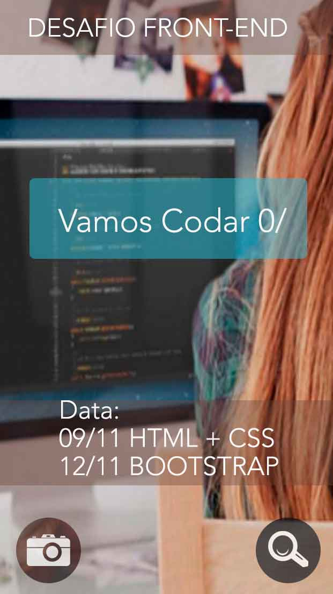
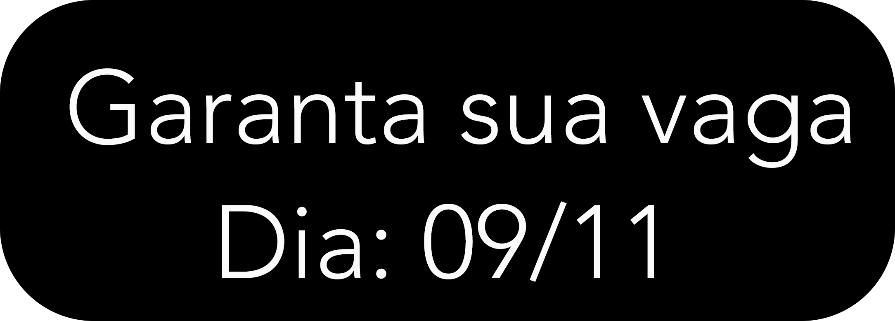
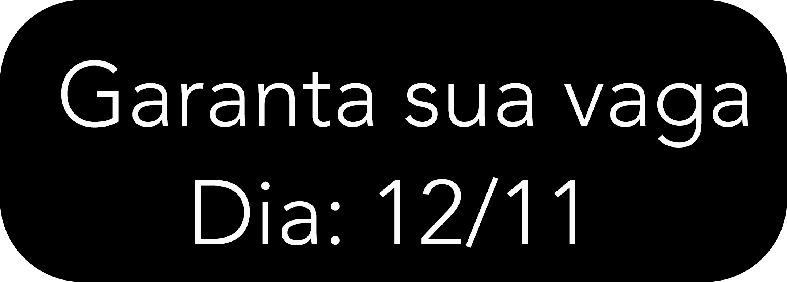

# Landing-page

Estrutura do top
<!DOCTYPE html>
<html lang="pt-br">

Estrutura do head

```html
<head>

    <meta charset="utf-8">
    <meta http-equiv="X-UA-Compatible" content="IE=edge">
    <meta name="viewport" content="width=device-width, initial-scale=1">
    <meta name="description" content="">
    <meta name="author" content="">

    <title>Desafio - Front-end</title>

    <!-- Bootstrap Core CSS -->
    <link href="vendor/bootstrap/css/bootstrap.min.css" rel="stylesheet">

    <!-- Custom Fonts -->
    <link href="https://fonts.googleapis.com/css?family=Lato" rel="stylesheet">
    <link href="https://fonts.googleapis.com/css?family=Catamaran:100,200,300,400,500,600,700,800,900" rel="stylesheet">
    <link href="https://fonts.googleapis.com/css?family=Muli" rel="stylesheet">

    <!-- Plugin CSS -->
    <link rel="stylesheet" href="vendor/font-awesome/css/font-awesome.min.css">
    <link rel="stylesheet" href="vendor/simple-line-icons/css/simple-line-icons.css">
    <link rel="stylesheet" href="vendor/device-mockups/device-mockups.css">

    <!-- Theme CSS -->
    <link href="css/new-age.css" rel="stylesheet">

    <!-- HTML5 Shim and Respond.js IE8 support of HTML5 elements and media queries -->
    <!-- WARNING: Respond.js doesn't work if you view the page via file:// -->
    <!--[if lt IE 9]>
        <script src="https://oss.maxcdn.com/libs/html5shiv/3.7.0/html5shiv.js"></script>
        <script src="https://oss.maxcdn.com/libs/respond.js/1.4.2/respond.min.js"></script>
    <![endif]-->

</head>
```
Estrutura do body

```html
<body id="page-top">

    <nav id="mainNav" class="navbar navbar-default navbar-fixed-top">
        <div class="container">
            <!-- Brand and toggle get grouped for better mobile display -->
            <div class="navbar-header">
                <button type="button" class="navbar-toggle collapsed" data-toggle="collapse" data-target="#bs-example-navbar-collapse-1">
                    <span class="sr-only">Toggle navigation</span> Menu <i class="fa fa-bars"></i>
                </button>
                <a class="navbar-brand page-scroll" href="#page-top">Start Front-end</a>
            </div>

            <!-- Collect the nav links, forms, and other content for toggling -->
            <div class="collapse navbar-collapse" id="bs-example-navbar-collapse-1">
                <ul class="nav navbar-nav navbar-right">
                    <li>
                        <a class="page-scroll" href="#desafio">Desafio</a>
                    </li>
                    <li>
                        <a class="page-scroll" href="#objetivos">Objetivos</a>
                    </li>
                    <li>
                        <a class="page-scroll" href="#participe">Participe</a>
                    </li>
                </ul>
            </div>
            <!-- /.navbar-collapse -->
        </div>
        <!-- /.container-fluid -->
    </nav>
```
Estrutura do header

```html
    <header>
        <div class="container">
            <div class="row">
                <div class="col-sm-7">
                    <div class="header-content">
                        <div class="header-content-inner">
                            <h1>Você quer saber como essa Landing page foi construida? Então participe desse desafio e aprenda 0/</h1>
                            <a href="#desafio" class="btn btn-outline btn-xl page-scroll">Start Front-end</a>
                        </div>
                    </div>
                </div>
                <div class="col-sm-5">
                    <div class="device-container">
                        <div class="device-mockup iphone6_plus portrait white">
                            <div class="device">
                                <div class="screen">
                                    <!-- Demo image for screen mockup, you can put an image here, some HTML, an animation, video, or anything else! -->
                                    
                                </div>
                                <div class="button">
                                    <!-- You can hook the "home button" to some JavaScript events or just remove it -->
                                </div>
                            </div>
                        </div>
                    </div>
                </div>
            </div>
        </div>
    </header>
```

Estrutura section id="desafio"

```html
    <section id="desafio" class="download bg-primary text-center">
        <div class="container">
            <div class="row">
                <div class="col-md-8 col-md-offset-2">
                    <h2 class="section-heading">Nosso desafio <hr>Ensinar você a criar essa<br>Landpagind Page</h2>
                    <p>No dia 09/11 você fará HTML e CSS e no dia 12/11 Finalizar com bootstrap</p>
                    <p>Obs: Você pode participar de apenas um dia ou dos dois</p>
                    <div class="badges">
                        <a class="badge-link" href="https://www.sympla.com.br/workshop-de-front-end-parte-1__99510"target="_blank"></a>
                        <a class="badge-link" href="https://www.sympla.com.br/workshop-de-front-end-parte-2__99511"target="_blank"></a>
                    </div>
                </div>
            </div>
        </div>
    </section>
```
Estrutura section id="objetivos"

```html
   <section id="objetivos" class="features">
        <div class="container">
            <div class="row">
                <div class="col-lg-12 text-center">
                    <div class="section-heading">
                        <h2>Esses são os objetivos dessa oficina:</h2>
                        <p class="text-muted">Não perca essa oportunidade e venha codar 0/</p>
                        <hr>
                    </div>
                </div>
            </div>
            <div class="row">
                <div class="col-md-4">
                    <div class="device-container">
                        <div class="device-mockup iphone6_plus portrait white">
                            <div class="device">
                                <div class="screen">
                                    <!-- Demo image for screen mockup, you can put an image here, some HTML, an animation, video, or anything else! -->
                                     </div>
                                <div class="button">
                                    <!-- You can hook the "home button" to some JavaScript events or just remove it -->
                                </div>
                            </div>
                        </div>
                    </div>
                </div>
                <div class="col-md-8">
                    <div class="container-fluid">
                        <div class="row">
                            <div class="col-md-6">
                                <div class="feature-item">
                                    <i class="icon-screen-smartphone text-primary"></i>
                                    <h3>Site Responsivo</h3>
                                    <p class="text-muted">Mostrar as vantagens do site responsivo.</p>
                                </div>
                            </div>
                            <div class="col-md-6">
                                <div class="feature-item">
                                    <i class="icon-globe text-primary"></i>
                                    <h3>Página web</h3>
                                    <p class="text-muted">Descubra como é estruturada uma página web. </p>
                                </div>
                            </div>
                        </div>
                        <div class="row">
                            <div class="col-md-6">
                                <div class="feature-item">
                                    <i class="icon-present text-primary"></i>
                                    <h3>Dicas de programação </h3>
                                    <p class="text-muted">Disponibilizar informações e dica para melhorar o seu desenvolvimento. </p>
                                </div>
                            </div>
                            <div class="col-md-6">
                                <div class="feature-item">
                                    <i class="icon-layers text-primary"></i>
                                    <h3>Framework Bootstrap</h3>
                                    <p class="text-muted">SEnsinar como ultilar e como funcionar o Framework Bootstrap </p>
                                </div>
                            </div>
                        </div>
                    </div>
                </div>
            </div>
    </section>
```
Estrutura section id="participe"

```html
    section id="participe"
    
        <section id="participe" class="cta">
        <div class="cta-content">
            <div class="container">
                <h2>Chegou a sua hora, vamos programar</h2>
                <a href="https://www.sympla.com.br/workshop-de-front-end-parte-1__99510"target="_blank" class="btn btn-outline btn-xl page-scroll" >garanta sua vaga Dia:09/11</a>
                <a href="https://www.sympla.com.br/workshop-de-front-end-parte-2__99511"target="_blank" class="btn btn-outline btn-xl page-scroll">garanta sua vaga Dia:12/11</a>
            </div>
        </div>
        <div class="overlay"></div>
    </section>
 ```
 Estrutura section contact

```html
 
     <section  class="contact bg-primary">
        <div class="container">
            <h2> Nos sigam <i class="fa fa-heart"></i> nas redes Sociais </h2>
            <ul class="list-inline list-social">
                <li class="social-twitter">
                    <a href="#"><i class="fa fa-twitter"></i></a>
                </li>
                <li class="social-facebook">
                    <a href="#"><i class="fa fa-facebook"></i></a>
                </li>
                 <li class="social-google-plus">
                    <a href="#"><i class="fa fa-github"></i></a>
                </li>
            </ul>
        </div>
    </section>

 ```
  Estrutura footer

```html
     <footer>
        <div class="container">
            <p>&copy; Desprograme = (<s>Descomplique</s> e Programe!) \0/</p>
            <ul class="list-inline">
                <li>
                    <a href="#">Site</a>
                </li>
                <li>
                    <a href="#">Github</a>
                </li>
                <li>
                    <a href="#">Facebook</a>
                </li>
            </ul>
        </div>
    </footer>
 ```
   Estrutura jQuery

```html
     <!-- jQuery -->
    <script src="vendor/jquery/jquery.min.js"></script>

    <!-- Bootstrap Core JavaScript -->
    <script src="vendor/bootstrap/js/bootstrap.min.js"></script>

    <!-- Plugin JavaScript -->
    <script src="https://cdnjs.cloudflare.com/ajax/libs/jquery-easing/1.3/jquery.easing.min.js"></script>

    <!-- Theme JavaScript -->
    <script src="js/new-age.min.js"></script>

</body>

</html>
 ```
